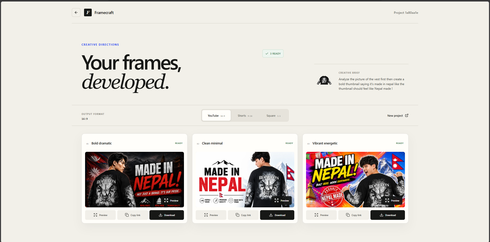
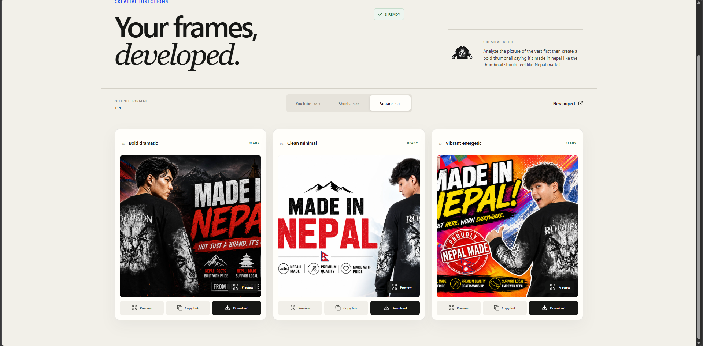
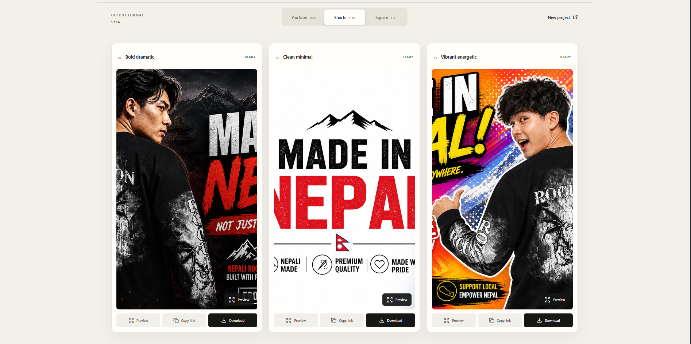
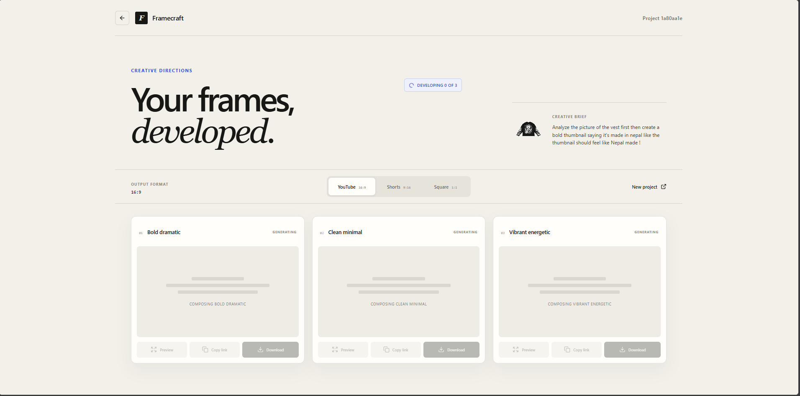

# Framecraft

A small studio that takes a photo and a creative brief to create up to 3 directions of a video for you to choose from :)

The final images are viewable, copyable and downloadable in 3 convenient shapes:

- **YouTube** — 16:9
- **Shorts** — 9:16
- **Square** — 1:1

## Why I made it

While good thumbnails are important, creating multiple directions of visualization can be time consuming. I wanted an easy first place to begin with a person's portrait and an idea, and then easily compare a bold, clean or more energetic direction.

## What happens when you use it

1. Upload a portrait (up to 10 MB) as a JPEG, PNG or WebP file.
2. Write a creative brief for the video in a short manner.
3. Select one, two or three concepts.
4. The portrait is uploaded to Framecraft, a generation job is created, and the progress is displayed while the thumbnails are being generated.
5. Preview, copy the image link or download the image in the desired format.

The three directions it has built in are bold dramatic, clean minimal, and vibrant energetic.

## Screenshots

### YouTube thumbnails

The framecraft displays include thumbnail directions in the ubiquitous 16:9 YouTube format.



### Square thumbnail

The square option will create a square version for platforms with square posts.



### Shorts thumbnail

The Shorts option makes a vertical 9:16 format for short form video.



### Processing state

This screen displays the progress as thumbnail directions are being generated.



## How it was made

The frontend application is a React + TypeScript application using Vite. It provides all the functions of the upload form, and job-status polling, previews and downloads.

The backend is a FastAPI app. It stores jobs in SQLite by default, uploads portraits and finished images to Cloudinary, and by using the OpenAI Images API, it can edit the provided portrait into a thumbnail. Cloudinary transformations create the YouTube, Shorts and square versions of the base image.

One crucial part was the feeling of reliability of the workflow: the app also checks the real image type and size of the uploaded image, the job status is kept clear, and jobs are not left unfinished but become failed if the server restarts instead of just waiting forever.

## Tech stack

- **Frontend:** React, TypeScript, Vite, React Router, TanStack Query, Lucide
- **Backend:** Python, FastAPI, SQLModel / SQLAlchemy, Uvicorn
- **AI:** OpenAI Images API (default `gpt-image-2`)
- **Image hosting:** Cloudinary
- **Database:** SQLite by default, or another database via `DATABASE_URL`

## Development

Please have [Node.js 22.13+](https://nodejs.org/) installed, [Python 3.10+](https://www.python.org/), an [OpenAI API key](https://platform.openai.com/api-keys) and a [Cloudinary account](https://cloudinary.com/).

### 1. Clone the project

```sh
git clone https://github.com/samyak-16/AI-Powered-Thumbnail.git
cd AI-Powered-Thumbnail
```

### 2. Set up the backend

Create and activate a virtual environment:

```sh
cd backend
python -m venv .venv
```

On Windows PowerShell:

```powershell
.\.venv\Scripts\Activate.ps1
```

On macOS or Linux:

```sh
source .venv/bin/activate
```

Install the Python packages:

```sh
pip install -r requirements.txt
```

Create `backend/.env` and add your keys:

```env
OPENAI_API_KEY=your_openai_api_key
CLOUDINARY_CLOUD_NAME=your_cloud_name
CLOUDINARY_API_KEY=your_cloudinary_api_key
CLOUDINARY_API_SECRET=your_cloudinary_api_secret

# These are optional:
OPENAI_IMAGE_MODEL=gpt-image-2
OPENAI_IMAGE_QUALITY=medium
DATABASE_URL=sqlite:///./thumbnailbuilder.db
CORS_ORIGINS=http://localhost:5173,http://127.0.0.1:5173
```

Run the API from the folder called `backend`:

```sh
uvicorn main:app --reload --app-dir src
```

It will be available at `http://127.0.0.1:8000`. FastAPI's interactive docs are at `http://127.0.0.1:8000/docs`.

### 3. Set up the frontend

Run the following command in another terminal:

```sh
cd frontend
npm install
```

Duplicate the file `frontend/.env.example` to `frontend/.env` and ensure that the file is pointing to the API:

```env
VITE_API_URL=http://127.0.0.1:8000
```

Start the frontend:

```sh
npm run dev
```

Click the link Vite prints to the URL in your terminal (usually `http://localhost:5173`).

## Useful commands

From `frontend`:

```sh
npm run dev      # start the frontend
npm run build    # type-check and create a production build
npm run lint     # check the frontend code
npm run preview  # preview the production build
```

When in `backend` and using the virtual environment, run the following command to:

```sh
python -m unittest discover -s tests
```

## Deployment note

The front end has a Vercel config. Set Vercel's project root to `frontend` and add `VITE_API_URL` as the public URL of your deployed backend. The backend should also be configured with the actual private values of its environment variables OpenAI and Cloudinary.

## AI disclosure

I have used CODEX as an AI Assistance . It helped me in solving some bugs in backend code and also I have used it to assist me in frontend part !  .  I did the frontend my self . There were some build issues . I took help from CODEX to solve them at final stage ! . 
